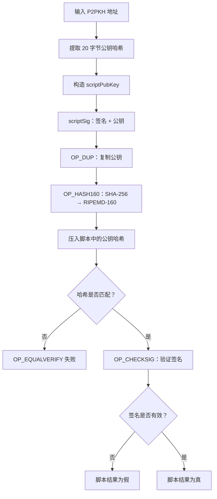
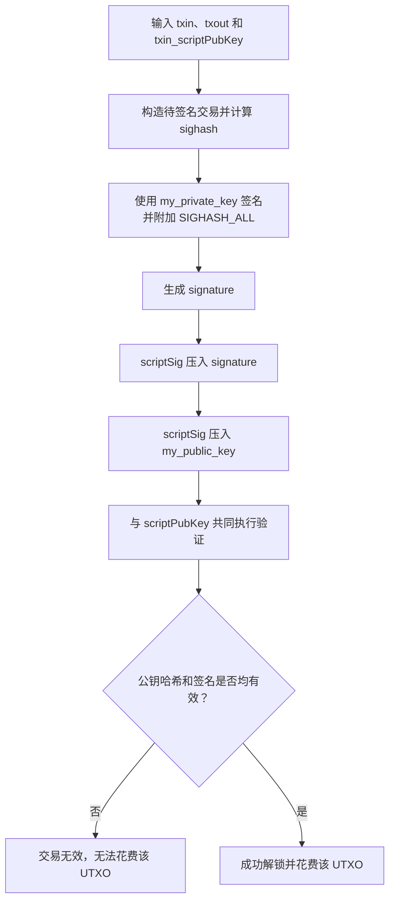
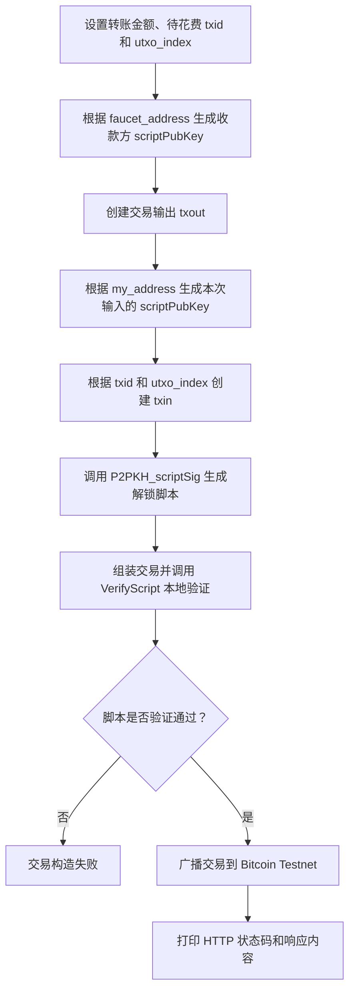

# <center>《区块链基础及应用》实验报告</center>

# <center>Ex1</center>

<center>学院：计算机学院  &ensp;&ensp; 专业：计算机科学与技术 &ensp;&ensp;姓名：刘宇泽  &ensp;&ensp;学号：2411334</center>

# 一、项目仓库

>https://github.com/liuyuze-121/NKU-Blockchains2026.git

# 二、实验内容
## 1. 测试币领取
运行`keygen.py`得到私钥和地址：


在`https://coinfaucet.eu/en`中领取`bitcoins`：


=='bitcoins`相关信息如下：==
- **tx:**3c8fcad8d744cd60738146062b4161d697758daefd497e74ea7599816568f2aa
- **address:**n2CaSMy8HL5yrBSPPCB62WiuWCN3ngEuzD
- **private key:**cSnjbL48d2VEPCNyLz7SUw5xf4GWQYKAWTFas5sVTzDBhfknad6M

跟踪交易得到：


## 2. 分块操作
### 补全'config.py'
填写一些相关的地址信息，将私钥替换成我们自己的私钥:
```python
my_private_key = CBitcoinSecret(
    'cSnjbL48d2VEPCNyLz7SUw5xf4GWQYKAWTFas5sVTzDBhfknad6M')
```
### 补全`split_test_coins .py`
```python 
    amount_to_send = 0.0001 # amount of BTC in the output you're splitting minus fee
    txid_to_spend = (
        '3c8fcad8d744cd60738146062b4161d697758daefd497e74ea7599816568f2aa')
    utxo_index = 0
    n=10 # number of outputs to split the input into
```
`各值含义：`
- **amount_to_send：**总花费的bitcoins的数量
- **txid_to_spend：**领取bitcoins时的tx值
- **utxo_index：**之前未进行过bitcoins的交易，所以交易对应的索引为0
- **n：**规定的分块的数量，这里将其拆分成10份

运行程序，就会输出分块结果,放在`result\split_output.txt`
跟踪交易得到

## 3. 发币操作

### 补全`ex1.py`

#### P2PKH_scriptPubKey 函数

该函数根据接收方的 P2PKH 比特币地址构造锁定脚本，用于约束后续交易必须提供与地址对应的公钥和有效签名。执行流程如下：

1. 从 `address` 中取得 20 字节公钥哈希 `HASH160(pubkey)`。
2. 按照标准 P2PKH 结构生成 `scriptPubKey`：`OP_DUP OP_HASH160 <pubkey_hash> OP_EQUALVERIFY OP_CHECKSIG`。
3. 花费该输出时，`scriptSig` 依次提供 `<signature> <public key>`。
4. `OP_DUP` 复制栈顶公钥；`OP_HASH160` 对复制的公钥依次执行 SHA-256 和 RIPEMD-160。
5. `OP_EQUALVERIFY` 比较新计算的哈希与地址中的公钥哈希；若不一致，脚本立即失败。
6. 哈希验证通过后，`OP_CHECKSIG` 使用原公钥验证签名；签名有效时脚本返回真，交易才能花费该输出。

```python
def P2PKH_scriptPubKey(address):
    ######################################################################
    return [
        OP_DUP,          # 复制 scriptSig 提供的公钥
        OP_HASH160,      # 对复制的公钥依次执行 SHA-256 和 RIPEMD-160
        address,         # 地址解码得到的 20 字节公钥哈希
        OP_EQUALVERIFY,  # 校验公钥哈希是否匹配，不匹配则脚本立即失败
        OP_CHECKSIG      # 使用原公钥验证 scriptSig 中的签名
    ]
    ######################################################################
```



#### P2PKH_scriptSig函数

该函数用于构造花费 P2PKH 输出时所需的 `scriptSig`（解锁脚本）。它根据当前输入、输出和待花费输出的 `scriptPubKey` 生成签名，并把签名和对应公钥放入脚本。

具体执行流程如下：

1. 将 `txin`、`txout` 和 `txin_scriptPubKey` 传入 `create_OP_CHECKSIG_signature`。
2. 使用上述信息构造待签名交易，并通过 `SignatureHash` 计算 `SIGHASH_ALL` 类型的签名哈希。
3. 使用全局配置中的 `my_private_key` 对签名哈希进行签名。
4. 在签名结果后附加 `SIGHASH_ALL` 标志，得到最终的 `signature`。
5. 返回 `[signature, my_public_key]`，二者将依次压入脚本栈，供 `scriptPubKey` 验证。

```python
def P2PKH_scriptSig(txin, txout, txin_scriptPubKey):
    signature = create_OP_CHECKSIG_signature(
        txin, txout, txin_scriptPubKey, my_private_key)
    return [signature, my_public_key]
```

其中，`signature` 证明交易发起者拥有对应私钥，`my_public_key` 用于让 `scriptPubKey` 检查公钥哈希，并验证该签名是否有效。


### 主函数

主函数用于设置本次交易需要花费的 UTXO、转账金额和接收方地址，并调用 `send_from_P2PKH_transaction` 完成交易的构造、签名、验证与广播。

本次实验使用的主要参数如下：

```python
if __name__ == '__main__':
    amount_to_send = 0.0000098
    txid_to_spend = (
        '4d2f936ea607ce54a9a66081226a0440b63ce4b861859f6749ad14ab0ad6402a')
    utxo_index = 0

    txout_scriptPubKey = P2PKH_scriptPubKey(faucet_address)
    response = send_from_P2PKH_transaction(
        amount_to_send, txid_to_spend, utxo_index, txout_scriptPubKey)
    print(response.status_code, response.reason)
    print(response.text)
```

参数含义如下：

- `amount_to_send = 0.0000098`：本次转出的金额为 `0.0000098 BTC`,这里不能写0.00001，需要留下一部分作为手续费，否则会因为零手续费被测试网拒绝。
- `txid_to_spend`：指定要花费的交易，此处为分币交易 `4d2f...402a` 的交易哈希。
- `utxo_index = 0`：选择该交易的第 `0` 号输出。分币交易共有 `10` 个输出，索引范围为 `0` 到 `9`，因此索引 `0` 表示花费其中的第 `1` 个输出，而不是表示“此前没有发生过交易”。
- `txout_scriptPubKey`：使用 `P2PKH_scriptPubKey(faucet_address)` 构造收款方的锁定脚本，将测试币发送到 faucet 地址。

主函数的执行流程如下：

1. 设置待花费交易的 `txid`、输出索引和转账金额。
2. 根据 faucet 地址生成收款方的 `scriptPubKey`。
3. 调用 `send_from_P2PKH_transaction` 创建交易输出 `txout`。
4. 根据自己的地址生成待花费输出的 `scriptPubKey`，并创建交易输入 `txin`。
5. 调用 `P2PKH_scriptSig` 生成签名，构造解锁脚本。
6. 调用 `create_signed_transaction` 组装交易，并在本地通过 `VerifyScript` 验证解锁脚本和锁定脚本。
7. 调用 `broadcast_transaction` 将交易广播到 Bitcoin Testnet。
8. 打印 HTTP 响应状态和返回内容，确认交易是否提交成功。



运行后得到发币结果，放在result\ex1_output.txt
跟踪交易得到：


成功发币


# 三、实验总结

本次实验完成了测试币领取、分币和发币流程，并补全了标准 P2PKH 交易所需的 `P2PKH_scriptPubKey` 和 `P2PKH_scriptSig` 函数。最终发币交易成功广播。

通过本次实验，我掌握了 P2PKH 的锁定与解锁流程，理解了公钥哈希校验、数字签名和 UTXO 花费之间的关系。实验中也发现，交易必须预留手续费，否则会因 `min relay fee not met` 被节点拒绝。
